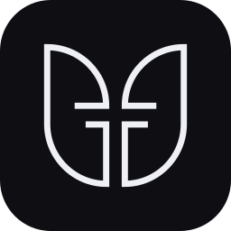
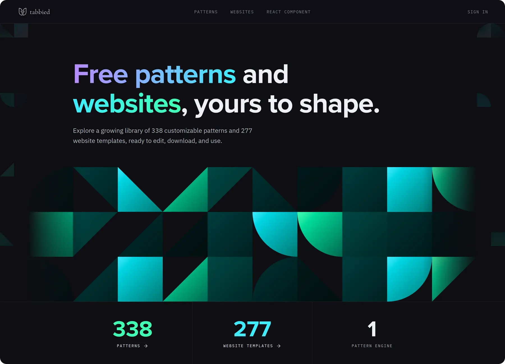
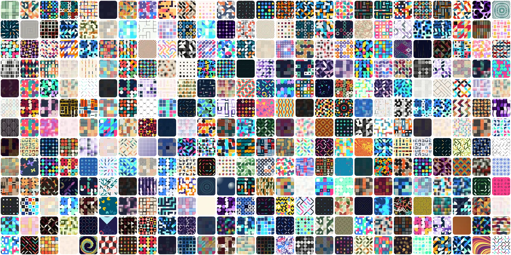
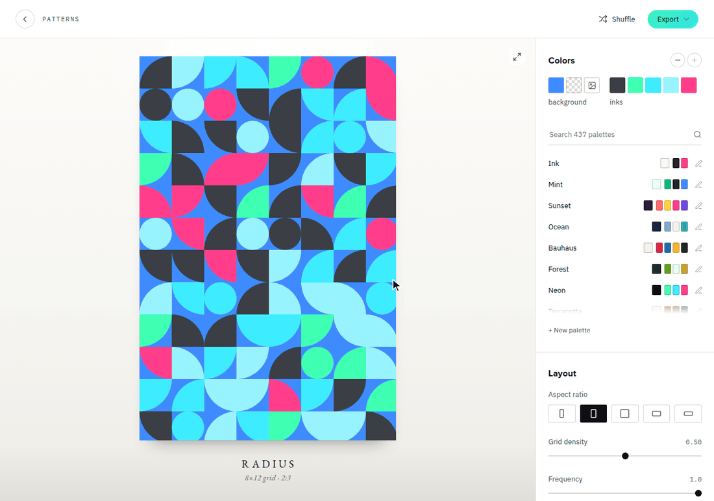
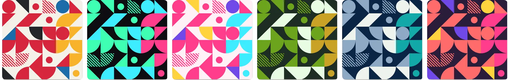
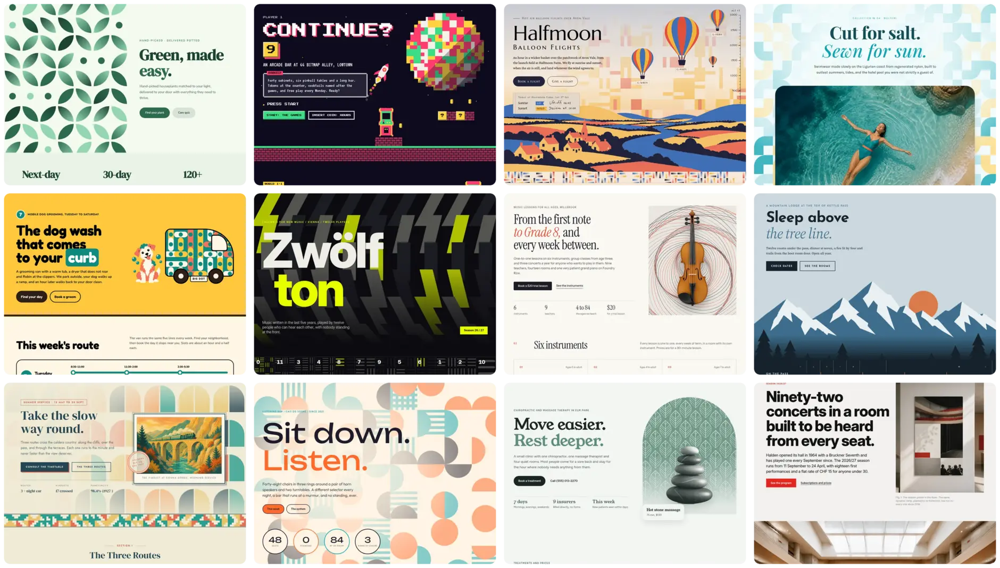
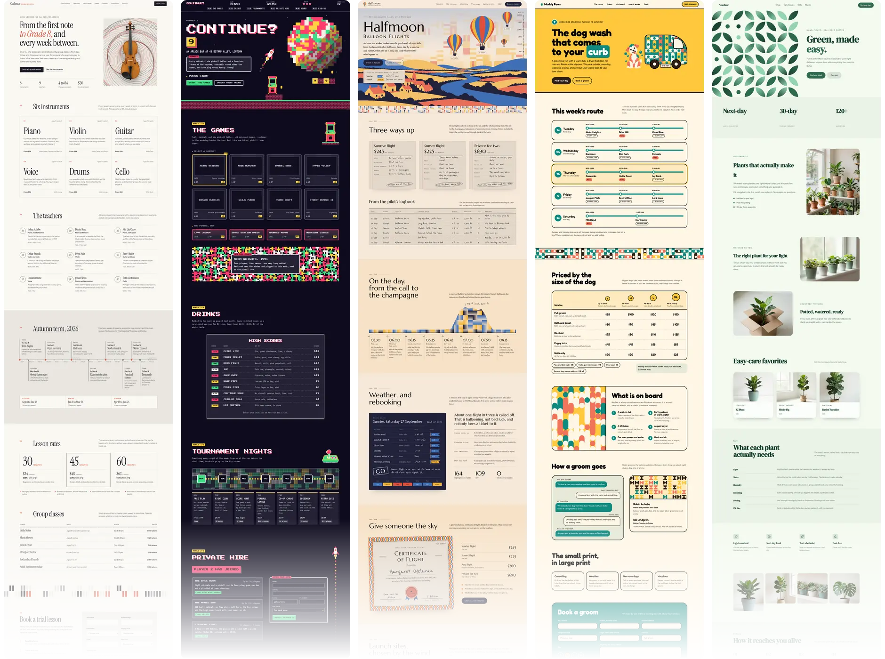
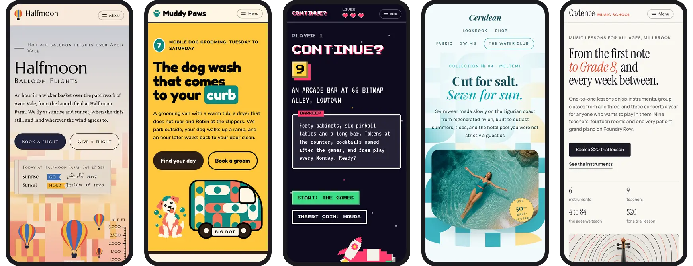

<p align="center">
  <a href="https://tabbied.com"></a>
</p>

<h1 align="center">Tabbied</h1>

<p align="center">
  <strong>Free patterns and websites, yours to shape.</strong><br>
  Pick a pattern, give it your colors and download it.<br>
  Or start from a website template that is built around one.
</p>

<p align="center">
  <a href="https://tabbied.com"><strong>Try it at tabbied.com</strong></a>
  &nbsp;|&nbsp;
  <a href="https://tabbied.com/patterns/">Patterns</a>
  &nbsp;|&nbsp;
  <a href="https://tabbied.com/templates/">Website templates</a>
  &nbsp;|&nbsp;
  <a href="https://tabbied.com/docs/react/">React component</a>
</p>

<p align="center">
  <a href="https://tabbied.com"></a>
</p>

## What is Tabbied?

Tabbied is a free set of tools for getting past the blank canvas. It has
**338 generative patterns**, **437 color palettes** and **277 website
templates**, and you can change every one of them to suit you: the colors,
how busy the pattern is, and the arrangement of the shapes themselves.

People use them for wall art, phone wallpapers, slides, posters, packaging,
book covers, and the website for their bakery. You don't need design skills,
and you don't need an account to start.

## A pattern for everything



Every Tabbied pattern is a small program rather than a picture, drawn fresh in
your browser. Press Shuffle and you get an arrangement nobody has seen before.
Browse them all in the [pattern library](https://tabbied.com/patterns/).

## Make it yours in seconds



1. **Pick your colors.** Choose one of 437 ready-made palettes, or click any
   swatch and mix your own.
2. **Play with it.** Shuffle the layout, choose a shape from tall to wide, and
   slide the density from a few bold shapes to a fine texture. Everything
   updates as you go.
3. **Download it for free.** Save a 3000px PNG for print, or a vector SVG you
   can scale as big as you like (most designs support it).

You can even put a photo of your own behind the pattern. It stays on your
computer and comes along in both downloads.

## Same pattern, any palette



Colors change everything. Choose a palette in the pattern library and every
card re-colors with it, so you can browse in the colors you already have in
mind.

## 277 website templates



Need a website instead of a picture? Every template is a complete one-page
site for a real kind of business: a plant shop, an arcade bar, a balloon ride
company, a music school, a dog groomer, a dentist, a bakery and lots more.
Each one is built around a Tabbied pattern and themed with a single palette,
which is why no two look alike.
[Browse them all](https://tabbied.com/templates/).

### Whole sites, not just a header



Each template has the sections a small business actually needs, from
services and prices to opening hours and a way to get in touch, with copy you
can read and replace.

### Ready for phones



Every template works on a small screen, with its menu tucked behind a tidy
button.

### Make a template yours

- **Re-color it.** Choose any of the 437 palettes and the whole site follows:
  backgrounds, text, patterns and, on many templates, the illustrations too.
- **Swap the patterns.** One click draws a fresh pattern for every patterned
  area on the page.
- **Download it.** Get plain HTML that opens straight from a folder, or a
  React project ready to run.

Templates are free with an account. During the beta each account can choose
five (and ask for more if you need them), and once a template is yours you can
customize and download it as often as you like.

## For developers

The patterns are also an open source library. Drop one into your own app:

```bash
npm install tabbied
```

```tsx
import { TabbiedPattern } from 'tabbied/react';
import { radius } from 'tabbied/patterns';

export function Banner() {
  return <TabbiedPattern pattern={radius} fit="cover" style={{ width: '100%', height: 320 }} />;
}
```

The [React docs](https://tabbied.com/docs/react/) and the
[package README](./packages/tabbied/README.md) cover the rest, including a
version without React.

Working with an AI assistant? Tabbied has an
[MCP server](https://tabbied.com/docs/mcp/), so tools like Claude Code can
search the patterns and look at them before choosing one:

```bash
claude mcp add --transport http tabbied https://tabbied.com/mcp
```

Want to run the site yourself or contribute? Setup, tests and deployment are
in [docs/development.md](./docs/development.md).

## Who made this

Tabbied is designed by [Syung Hong](https://www.syunghong.com/) and built by
[Ye Joo Park](https://park.is). We would love to hear what you make with it:
write to [hello@tabbied.com](mailto:hello@tabbied.com) or
[open an issue](https://github.com/tabbied-design/tabbied/issues).

Every pattern is drawn by [css-doodle](https://css-doodle.com/), made by
[Yuan Chuan](https://yuanchuan.dev/). Thank you!

## License

The `tabbied` pattern library (its patterns included), the MCP server and
`tabbied-templates` are open source under the MIT License: see the LICENSE
file in each of their folders under [`packages/`](./packages).

Everything else here, the website templates and their pictures above all, is
proprietary: see [LICENSE](./LICENSE). A template is yours to use once you
choose it with a Tabbied account, under the
[Template License](https://tabbied.com/terms-of-service/#template-license).
Reading its source here, or its preview on the site, doesn't license it.
